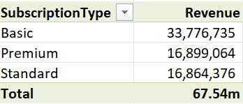
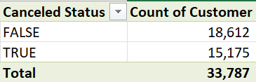
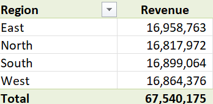
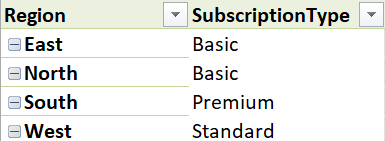

# Subscription Pattern Insights


## Introduction

In this portfolio, I analyzed subscription data to derive insights on customer behavior and revenue generation. The analysis leverages Excel for data cleaning and pivot tables, SQL for querying data, and Power BI for visualization.

## Data Overview

### Dataset Description: 

- **Customer Name**: Name of the subscriber.
- **Subscription Types**: Various subscription plans (e.g., Basic, Premium).
- **Subscription Start and End Dates**: Dates marking the beginning and end of the subscription.
- **Region**: Geographic location of the customer.
- **Canceled Status**: Indicates whether the subscription is active or has been canceled.
- **Revenue**: The amount earned from each subscription.

 ## Tools Used

- Excel
- SQL
- Power BI

-------

## Data Cleaning in Excel

**Importing Data**: The data was imported from my local file.

  **Data Cleaning Steps:** 
   
- **Removing Duplicates:** I Observed duplicates while going through the data sets and I used the remove duplicates feature to clean duplicates.
- **Date Formatting:** Ensure that the start and end dates are in a consistent format for analysis.

## Data Analysis with Excel Pivot Tables

**A. Total Revenue by Subscription Type**:
A key insight was that the Basic subscription type ranked highest in  total revenue generation compared to other subscription tiers, such as Premium and standard.

 

 **B. Count of Active vs. Canceled Subscriptions:**
This analysis of the count of active versus canceled subscriptions provides actionable insights into customer behavior. 



**C. Revenue by Region:**
The analysis reveals that the East Region is the highest revenue generating region with a total revenue of 16,958,763m. This indicates potential areas for further investment and targeted marketing to capitalize on this trend.



**D. Region by Subscription Type:**
The analysis shows that both the East and North regions have a notable presence of Basic subscriptions, indicating that these areas may be more price sensitive or prefer budget friendly options. This presents an opportunity for targeted marketing campaigns aimed at upselling Premium subscriptions in these regions.



## Using Excel Formulas

- **Average subscription duration:** Using the Average function, I was able to retrieve the average subscription duration to be 365 days.

                                          =AVERAGE(I2:I33788)

-  **The most popular subscription type:** I retrieved the most popular subscription type using the **COUNTIF** function and the subscription Type column. **Basic** is the most popular subscription type with 16,921 subscriptions.

                                           =COUNTIF(D2:D33788, L7)

----------

## SQL Queries
This is a quick overview of some SQL commands used to retrieve the subscription trends.

**A. This query retrieves the average subscription duration for all customers**.
```sql
       SELECT AVG(DATEDIFF(DAY, SubscriptionStart, SubscriptionEnd)) 
         AS AverageSubDuration
        FROM [dbo].[CustomerData]
        WHERE Canceled = 'FALSE';
```

**B. Customers with subscriptions longer than 12 months.**

```sql                                   
      SELECT CustomerID
             SubscriptionType,
	            SubscriptionStart,
	            SubscriptionEnd
      FROM [dbo].[CustomerData]
      WHERE DATEDIFF(MONTH, SubscriptionEnd, SubscriptionStart)
      > 365
      AND Canceled = 'FALSE'
```


**C. This query returns the total revenue by subscription type.**

```sql
      SELECT SubscriptionType,
      SUM(Revenue) AS TotalRevenue
      FROM [dbo].[CustomerData]
      GROUP BY SubscriptionType
      ORDER BY TotalRevenue DESC;
```

**D. This query retrieves the top 3 regions by subscription Cancellation, which are South, North ,and West.**

```sql
      SELECT TOP 3 Region,
      COUNT(*) AS CancellationCount
      FROM [dbo].[CustomerData]
         WHERE 
      Canceled = 'TRUE'
      GROUP BY Region
      ORDER BY CancellationCount DESC
```

**E. This retrieves the total number of Active and Canceled subscriptions.**

```sql
      SELECT Canceled,
      COUNT(*) AS TotalCount
      FROM [dbo].[CustomerData]
      WHERE Canceled IN ('FALSE', 'TRUE')
      GROUP BY Canceled;
```

-----------

## Power BI Subscription Pattern Dashboard
This visual showcases my Power BI dashboard analyzing subscription patterns.

**A. Technologies Used**
- Power BI
- DAX
- Slicers

**B. Dashboard Preview and Analysis**


**A. Total Revenue Over Time:** As shown in the **card**, the total revenue generated was **67.5M**.

**B. Revenue by Subscription Type:** The Basic subscription type generates **33.78M**(50%) of the total revenue over time.

**C. Subscription type by Subscriber Count:** The treemap highlights that while the Standard has fewer subscribers, its higher price point significantly impacts revenue. This suggests that focusing on upselling may yield more revenue.

**D. Revenue by Subscription Status:** The analysis reveals False status has 55.09% revenue while canceled subscription status generated 44.91% Revenue.

**E. Revenue by Region:** The East region has the highest revenue of 16.96m. This is also the same region with the highest revenue in the Basic Subscription pattern. That indicates all users in the east subscribe only to the Basic subscription.

**F. Geographical Distribution:** Our popular subscription types are from the Northeast region, accounting for 17m in East and 16.8m in North (50%) of our total users. The matrix table indicates a strong concentration of users in the Northeast subscribing to the Basic subscription type. We should consider localized marketing efforts to tap into the other regions with higher subscription types.

--------

## Summary and Conclusion

### Summary:

In this portfolio, I conducted a comprehensive analysis of subscription data to uncover key insights into customer behavior and revenue generation. Utilizing various tools including Excel for data cleaning and analysis, SQL for querying, and Power BI for visualization, I aimed to provide a detailed understanding of subscription patterns.
The dataset examined includes critical attributes such as customer names, subscription types, subscription start and end dates, region, cancellation status, and revenue figures. 

**Key findings from the analysis include:**

- **Revenue Generation**: The **Basic** subscription tier emerged as the highest revenue generator, contributing approximately **50%** of the total revenue, which highlights its popularity among customers.
  
- **Customer Retention**: A substantial segment of subscriptions remains active, with **55.09%** active and **44.91%** canceled. This ratio indicates the potential for improving retention strategies to lower cancellation rates.

- **Regional Insights**: The **East** region stands out as the top performer in revenue generation, with nearly 17 million earned, underscoring a strategic area for targeted marketing and investment. The concentration of Basic subscriptions in this area suggests a distinct preference for budget-friendly options.

- **Duration**: The average subscription duration was determined to be 365 days, indicating a solid engagement level among subscribers with long-term plans. 

- **Active vs. Canceled Subscriptions**: The analysis introduced a more granular view of subscription status, revealing patterns that can inform customer retention strategies and targeted communications.

### Conclusion

- The insights derived from the subscription data analysis reveal significant opportunities for enhancing customer engagement and revenue optimization. The popularity of the Basic subscription plan underscores the need for tailored marketing strategies, especially in regions with high concentrations of budget-conscious customers. 

- To improve subscription retention, I recommend implementing personalized retention programs that address the reasons behind cancellations, focusing on customer feedback, and enhancing customer satisfaction.

- Additionally, the strong performance of the East region suggests that localized marketing efforts could effectively cultivate customer loyalty and potentially encourage upgrades to higher-priced subscription tiers. 

- Overall, this analysis not only illustrates my analytical skills but also emphasizes the value of data-driven decision-making in maximizing customer satisfaction and driving business growth. The insights gained can be leveraged to inform strategic initiatives aimed at improving the overall subscription experience.


# Thank You


 


      


